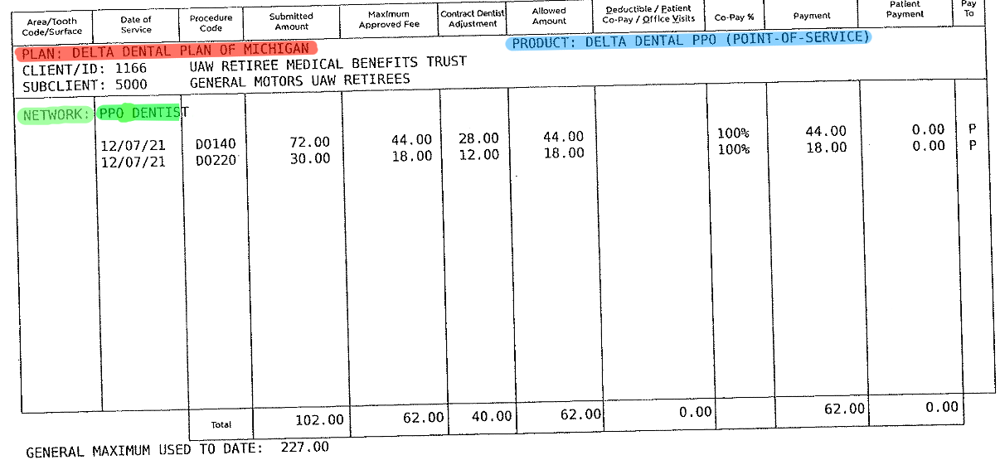
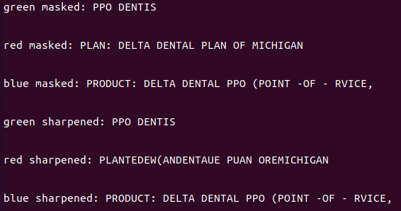

# HIGHLIGHT RECOGNITION 

---
# Highlighting Some Text
#
#

* Highlight important data fields

* The fields can be categorized by color

* Turned out to be not-so-efficient, but had interesting results

---
# Highlighting Some Text
#
#

* PLAN, PRODUCT, and NETWORK sections are highlighted in red, green and blue respectively. 
* note the line between S|T causes some confusion, more on this later.

---

---
# Masking the Text
#
#

* used python and opencv (cv2) to create a color mask which 
* mask isolates the data fields, allowing for seperate interpretations
* A mask for each color was applied to the highlighted document.

---

### Masking the Text
 
 

---

# Image Sharpening
#

* Attempted to improve the text recognition by transforming the masked images with a sharpening filter. 
* sharpening was accomplished by applying a matrix kernel to the image pixels 
* The sharpened images turned out to be less recognizable than the original.

---

### Image Sharpening

 

---

# Interpretation of Text
#
#
#
* the masked image was interpreted by the opencv (cv2) library to extract the text which was highlighted.

---

### Interpretation of Text

---

# Conclusion
* extracted text from the data fields which were highlighted.
*  they then were labeled according to the color which was used.
* After labelling the data might be exported to a comma sepperated value file for easier processing.

---

# Conclusion (cont.)

* The program was not perfect at recognizing the data field text. 
* A possible fix to this might include a predictive matching algorithm 
* algorithm would recognize when the interpreted text is close to an expected string. 
* After recognizing the similarity, the program replaces the incorrect text with what is expected for that field. 
